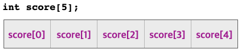

# Array Declaration and initialization (배열 선언과 초기화)

# 배열 선언

변수를 사용하기 위해서 변수를 선언하였듯이 배열을 사용하기 위해서는 배열을 선언하여야 한다. 
배열 선언을 통해 컴파일러에게 배열 요소의 개수가 몇 개이고 각 요소의 자료형도 함께 명시하여야 한다. 
배열을 선언하려면 변수의 선언과 같이 자료형이 지정되어야 한다. 다음에 배열 이름과 자료형의 저장공간을
몇 개를 할당하여야 하는지 다음과 같이 대괄호를 이용하여야 한다.

```C++
자료형 배열이름[배열크기];
 ```

정수형의 학생 성적을 저장할 저장공간 5개를 할당하기 위한 배열 score의 선언은 다음과 같다. 

```C++
int score[5];  // 5개의 int 형 저장장소를 할당하는 배열 score
```
변수를 선언할 때 **대괄호([])** 는 배열 선언 시 함께 할당하는 저장공간의 개수를 지정하기 위해서 사용된다.


문자형 데이터를 10개 저장할 수 있는 배열 name을 선언하면 다음과 같다.
``` C++
char name[10]   // 10개의 char형 저장장소를 할당하는 배열 name
```


배열을 선언하면 메모리에 지정한 개수만큼 연속적으로 할당한다. 
score와 name은 배열의 이름이며 이는 연속적으로 할당된 메모리 저장공간의 시작주소를 의미한다.
배열 score의 선언을 통해 학생 성적을 다섯 개를 저장할 수 있는 저장공간이 할당되었는데 다섯 개의 저장공간의 각각을 식별할 수 있어야 한다.  
배열의 요소를 구분하기 위해서 저장공간에 번호(인덱스)를 부여합니다. 
배열의 첫 요소의 인덱스는 [0]이고 인덱스 값이 1씩 증가시키며 요소를 구분한다.
배열의 요소를 구별하는 인덱스는 **0**에서 시작한다. 
배열의 인텍스의 최대 값은 **'배열크기 -1'** 이다. 
앞의 배열 score와 name의 경우 최대 인덱스 값은 각각 4, 9 이다.

배열을 선언할 때 사용하는 대괄호 선언하는 변수가 배열임을 알리고 선언 시 할당할 저장공간의 크기를 규정하는데 사용한다. 
배열의 크기는 반드시 0 보다 큰 정수형 상수로 설정해야 한다. 배열의 크기에 변수를 사용하는 것은 불가능하다. 
또한 초기화하지 않으면서 배열의 크기를 설정하지 않으면 안된다. 

배열의 크기를 지정할 때는 앞에서와 같이 리터럴 상수 또는 다음과 같은 매크로 상수를 사용할 수 있다. 
```C++
#define MAX 5
int score[MAX];
```

sizeof 연산자를 배열이름에 대해서 사용하면 배열의 바이트 크기를 구할 수 있다. 
배열 score에 sizeof 연산자를 적용하면 sizeof(score)가 된다. 

```C++
#include <iostream>

using namespace std;

int main(int argc, char const *argv[])
{
	int score[5];
	char department[] = "Game_Engineering";

	cout << "size of score[]: " << sizeof(score) << endl;
	cout << "size of department[]: " << sizeof(department) << endl;
	return 0;
}
```
앞의 프로그램의 결과는 다음과 같다. 


#  배열의 초기화

배열을 선언과 동시에 초기화는 다음과 같이 할 수 있다.
```C++
int score[5] = {10, 20, 30};
char name[10] = "John";
```

배열의 선언과 동시에 초기화를 하는 경우에는 배열의 크기를 다음과 같이 명시적으로 표현하지 않아도 된다.
```C++
double area[] = {10.1, 20.2, 30.4, 40.4};    // 초기화하는 데이터가 4개 이므로 배열 area의 크기는 4 임
char department[] = "Game_Engineering";      // 초기화하는 문자열의 문자 수가 16개이고 문자열을 저장하므로 배열 department의 크기는 17 임
```
