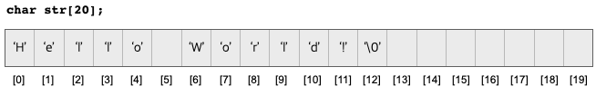

# 배열과 문자열

문자열(string)은 단어와 문장과 같이 문자들의 모임으로 문자형 배열에 저장을 하고 처리를 한다. 
문자열 리터럴은 쌍 따움표(" ")를 이용하여 표현한다.
다음은 문자열 리터럴의 예이다.

```C++
"A"
"School"
"Hello World!"
"How are you!"
```
문자 리터럴과 문자열 리터럴과 달리 문자 한 개를 표현한다. C++에서 문자는 문자열과 달리 
일반 따옴표('')로 묶어서 표현한다. 

문자열을 프로그램에서 사람들의 이름, 주소, 학과 이름, 학교 이름 등 모두 문자열로 저장된다. 
쌍 따움표를 사용하여 표시되는 문자열은 문자열 상수로 변경이 불가능하다. 

문자열은 "Hello World!" 와 같이 연속된 문자로 C++에서는 다음과 같이 문자형(char) 배열에 
저정된다. 

```C++
char str[20] = "Hello World!";   // char형 배열 선언과 초기화
```
문자형 배열 str은 20개의 문자를 저장할 수 있는 공간이며 다음과 같이 str[0]에는 문자 'H', str[1]에는 'e' 가
차례로 저장된다. 




