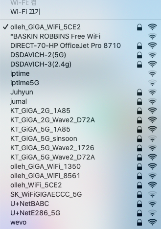
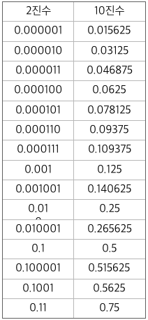
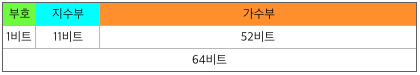

# 프로그램 기본 요소

## 변수와 상수

컴퓨터 프로그램은 실생활의 다양한 데이터를 처리하는 것이다. 
컴퓨터 메모리에 저장된 데이터의 값을 변경할 수 있는지 없는지에 따라 변수(variable)과 상수(constant)로 구분된다. 
변수는 수학에서 미지수와 같이 대입한 값을 변경할 수 있는 것과 같이 프로그램 수행 중에 메모리에 저장된 값을 변경할 수 있는 것이고 
상수는 전공에서의 빛의 속도, 원주율, 중력 가속도 등과 같이 값이 결정되어 있어 변경할 수 없는 것으로 
프로그램 수행 중에 메모리에 저장된 값을 변경할 수 없는 것이다.

- 프로그램에서 변수: 저장된 내용이 변경이 가능한 메모리의 저장공간
- 프로그램에서 상수: 메모리의 저장공간에 한번 저장할 수 있으며 저장 후 변경이 불가능한 저장공간 

## 컴퓨터의 데이터 표현

우리가 일상생활에서 널리 사용되는 10진수 체계는 차지하는 자리 공간(위치)에 따라 10의 지수 형태 (10^n: n = 0..)를 가진다 (^는 거듭제곱 연산을 나타냄). 즉 수의 오른쪽 끝 부터 1, 10, 100, 1,000, 10,000 등의 자리 값을 가진다. 다음의 10진수 345가 있다고 하자. 345는 세 개의 자리공간을 차지하며 5가 있는 자리는 10^0, 4의 자리는 10^1, 3의 자리는 10^2의 값을 가진다. 그러므로 
```
345 = 3 * 100 + 4 * 10 + 4 * 1
``` 
라는 의미이다. 

컴퓨터에 저장되는 모든 데이터는 2진수로 표현된다. 2진수는 10진수와 같이 여러 자리 공간을 차지하는데 각 자리 공간마다 0과 1의 값을 가지며 수의 오른쪽 끝 부터 
0(2^0), 2(2^1), 4(2^2), 8(2^3),... 의 자리 값(이 때의 자리 값은 10진수의 값)을 가진다. 2진수로 표현할 때 자리 공간 하나를 비트(bit)라고 한다. 

예로 2진수 1101를 10진수로 표현하면 1 * 8 + 1 * 4 + 0 * 2 + 1 * 1 의 의미이다. 즉, 2진수 1010은 10진수로 13을 의미한다. 이 관계로 부터 10진수 값은 2진수로 표현이 가능함으로 추론할 수 있다.

### 2진수를 사용한 10진수 정수 표현

앞에서 2진수로 10진수를 표현할 수 있다는 것을 간단하게 살펴보았다. 이제 10진수 정수를 2진수로 표현하는 방법에 대해서 상세하게 살펴보았다. 
10진수 정수는 양수, 0, 음수로 구분된다. 그러므로 2진수의 컴퓨터에 10진수 정수를 저장하기 위해서는 양수와 음수를 구분하는 부호비트가 필요하다. 
2진수로 10진수 정수를 표현하기 위한 가장 기본적인 방법은 아래와 같은 부호와 값의 영역으로 나누어 표현하는 방법이 있다.

#### 부호-크기 표현 

부호-크기 표현방법은 MSB(Most Significant Bit)의 부호 비트를 제외한 나머지 부분은 값을 표현하는데 사용한다.
MSB가 0 이면 양수, 1이면 음수를 뜻한다. 
8bit를 활용하여 정수를 표현하는 경우를 고려하자. 
```
+19: 00010011
-19: 10010011
```
8bit의 저장공간으로 정수를 표현할 경우 -127 ~ +127까지의 값을 표현한다. 이 경우 +0, -0 이 존재하기 때문에 대부분의
컴퓨터는 이 방식을 사용하지 않는다. 그리고 덧셈과 뺄셈 연산 과정이 복잡헤진다. 이러한 문제를 해결하기 위해 보수 개념이 
활용된다. 


#### 보수 표현
보수 개념은 파스칼이 10진수 연산을 위해 제안된 것이다. 
10진수에서 보수는 10의 보수와 9의 보수가 존재하고 2진수에서 보수는 2의 보수와 1의 보수가 존재한다. 

10진수 11의 보수로 9의 보수와 10의 보수가 있다. 10의 9의 보수는 99-11 = 88 이고 10의 보수는 89이다.
다음의 뺼셈을 고려해 보자.  
  * 20 - 11
  * 20 - 30
  * 20 - 20
  
```20 - 11``` 연산을 10의 보수를 이용한 덧셈으로 변경하면 (20 + 89) = 109 가 얻어진다.
여기서 두 자리 범위를 넘어간(오버플로우) 1가 발생하면 나머지 두 자리의 값(09)으로 부터 ```9```의 값을 얻게되고 이 것이 
```20 - 11```의 결과이다. 

```20 - 30``` 연산을 10의 보수를 이용한 덧셈으로 변경하면 (20 + 70) = 90 가 얻어진다. 
여기서 두 자리 범위를 넘어간 수(오버플로우)가 0이므로 나머지 두 자리의 값인 90은 음수이다. 90의 10의 보수가 10이므로 
결과값은 ```-10``` 이라는 결과를 얻을 수 있다. 

```20 - 20``` 연산을 10의 보수를 이용한 덧셈으로 변경하면 (20 + 80) = 100 가 얻어진다. 결과 값은 ```0```이 된다. 
이를 9의 보수를 이용한 덧셈으로 변경하면 (20 + 79) = 99 가 얻어진다. 오버플로우가 발생하지 않으므로 9의 보수 "99" 도 0의 값을 가진다.

2진수 00110110 은 10진수로 54 이고 1의 보수는 11001001이고 2의 보수는 11001001 + 1 = 11001010 이다.
일반적으로 __2의 보수 = 1의 보수 + 1__ 이다. 

앞에서 논의했던 두 식을 2진수로 연산하는 것을 살펴보자. 앞의 10진수 11, 20, 30을 부호 비트가 있는 1바이트(8비트)의
저장공간을 사용하여 표현하면 00001011, 00010100, 00011110 이다.

```20 - 11 ```을 2의 보수를 활용하여 연산을 하면 ```00010100 + 11110101```로 표현되고 결과는 **1**00001001 로 오버플로우가 발생하여 최종 결과는  ```00001001```로 10진수 9이다. 

```20 - 30```을 2의 보수를 활용하여 연산을 하면 ```00010100 + 11100010``` 로 표현되고 결과는 11110110 로 오버플로우는 발생하지 않고 MSB가 ```1```로 음수이다. ```11110110```의 2의 보수가 00001010로 10진수로 -10이다. 

 ```20 - 20```을 1의 보수를 활용하여 연산을 하면 ```00010100 + 11101011```로 표현되고 결과는 11111111 로 1의 보수의 경우 0의 의미를 가진다.
 이를 2의 보수를 활용하여 연산을 하면 ```00010100 + 11101100``` 로 표현되고 결과는 **1**00000000 로 0의 결과를 갖는다. 
 2의 보수의 경우 0이 하나이나 1의 보수는 0이 **00000000**과 **11111111** 두 개가 있다. 
 그러므로 음수를 표현할 경우 2의 보수를 사용한다. 


#### 저장 공간의 크기와 표현이 가능한 정수 값 

8bit로 표현하면 1bit가 부호 비트로 사용된다. **0**0000000 은 0,  
양수는 2진수로 **0**0000001 ~ **0**1111111 범위를 가지며 이는 10진수로 +1 ~ +127 의 수를 표현한다. 
10진수 -1은 1의 보수로 **1**1111110 이다. 
1 + (-1)을 하면 00000001 + 11111110 = 11111111 이 되며 ```11111111```도 -0이 되어야 한다.
1의 보수로 음수를 표현하면 **1**0000000 ~ **1**1111110 범위를 가지며 이는 10진수로 -127 ~ -1의 수를 표현한다.
그리고 0의 값이 +0, -0의 값으로 **0**0000000, **1**1111111 두 개를 가진다. 
그러므로 1의 보수로 표현할 경우 -127 ~ +127 의 수를 표혐하고 0을 표현하는 것이 2 개가 된다. 

10진수 -1은 2의 보수로 **1**1111111 이다. 
1 + (-1)을 하면 00000001 + 11111111 = 00000000 으로 0이 된다.
-127은 2의 보수로 **1**0000001 이다. **1**0000000은 10진수로 -128이 된다. 
그러므로 

### 2진수를 사용한 10진수 실수 표현 

컴퓨터에서 10진수 실수를 2진수로 표현하는 방법은 10진수 정수를 2진수로 표현하는 방식보다 복잡하다. 
10진수 실수 값은 소수점을 기준으로 정수 부분과 소수 부분으로 구분된다. 
정수 부분은 10진수 정수를 표현하는 방법과 같으며 소수 부분의 표현은 2의 음수 지수의 형태로 표현된다. 
소수 부분의 자리 공간에 따른 값은 다음 그림과 같다. 소수점을 기준으로 바로 오른쪽 공간의 값은 아래의 표와 같다. 



예로 10진수 0.625를 2진수로 표현하면 0.101 이다. 0.101 = 1 * 0.5 + 0 * 0.25 + 1 * 0.125 로 10진수 0.625는 2진수 0.101 이 된다. 
10진수 0.725를 2진수로 표현하면 0.11 이다. 아래의 표를 살펴보면 소수 부분은 (1/2)의 거듭제곱의 합으로 표현되고 있다.


	
만약 10진수 0.4를 2진수로 표현하면 0.00110011.... 의 형태로 (0011)이 무한 반복된다. 즉 표에서 알 수 있듯이 비트의 수가 유한한 2진수로  
표현하지 못하는 소수가 존재하기 때문에 컴퓨터에는 표현할 수 있는 가장 근사치 갑이 저장된다. 
이러한 근사 값을 저장하는 방법에는 __고정소수점__ 과 __부동소수점__ 의 두 가지 형태가 있다. 

#### 고정소수점 표현방식

고정소수점 표현방식은 정수 부분을 표현하는 비트수와 소수를 표현하는 비트 수를 사전에 정한 후 해당 비트 수 만을 사용하여 수를 표현하는 방식이다.
만약 정수를 표현하는 비트를 증가시키면 큰 수를 표현할 수 있으나 정밀한 수를 표현하는 것이 어려우나 
소수를 표현하는 비트 수를 늘리면 정밀한 수를 표현할 수 있으나 큰 수를 표현할 수 없다. 
이 문제를 해결하기 위해서 소수점의 위치를 고정하지 않고 소수점의 위치를 움직일 수 있도록 하는 부동소수점 표현방식이 있다. 

예로 432.4를 4 bytes(32bits)의 저장 공간을 활용하여 정수 표현에 16bits, 소수 표현에 15bits를 부호에 1bit를 사용한다면 다음과 같다.

```(0)000000110110000.001100110011001```

#### 부동소수점 표현방식

부동소수점을 표현하는 방식도 양석에 따라 다를 수 있으나 일반적으로 사용하는 방식은 IEEE에서 표준으로 제안한 방식 (IEEE 754 표준) 이다.
부동소수점 표현방식은 가수부와 지수부로 표현하는 방식으로 다음과 같은 수식을 이용하여 큰 실수까지도 표현이 가능하다. 

```
+/-(1.가수부)x2^(지수부-127)
```
아래는 32 비트로 사용하여 실수를 표현할 때 지수부와 가수부의 할당을 IEEE 부동소수점 표준에 따라 나타낸 것이다.


다음은 64 비트를 사용하여 실수를 표현할 때 지수부와 가수부의 할당을 IEEE 부동소수점 표준에 따라 나타낸 것이다. 



#### 부동소수점 표현방식의 오차

부동소수점 표현방식을 활용해서 실수를 표현할 경우 실수를 정확하게 표현하지 못하고 근사치로 표현되는 경우가 있다.
부동소수점 표현방식으로 실수를 표현할 떄 오차를 보여주는 예제로 0.2를 1000번 더하면 예상되는 결과는 200 이 되어야 하는데
프로그램 실행 결과는 199.998 로 계산된다. 

```C++
#include <iostream>

using namespace std;

int main(int argc, char const *argv[])
{
	float sum = 0.0;

	for(int a = 0; a < 1000; a++)
		sum += 0.2; 

	cout << sum << endl;

	return 0;
}
```
다음과 같은 결과를 얻었다. 
```
199.998
[Finished in 5.4s]
``` 


## 자료형의 의미
이름, 나이, 성별, 사진, 오디오, 비디오, 문서 등과 일상 생솰의 다양한 형태의 데이터가 
컴퓨터 프로그램에서 다루어지기 위해서는 메모리에 저장이 되어야 한다.
프로그램에서 다루는 다양한 형태의 일상생활의 데이터 모두는 컴퓨터 내에서 2진수로 표현되고 저장된다. 일상 생활의 데이터는 크게 수와 문자(기호)로 구분할 수 있으며
수는 다시 정수와 실수로 구분하게 된다.


