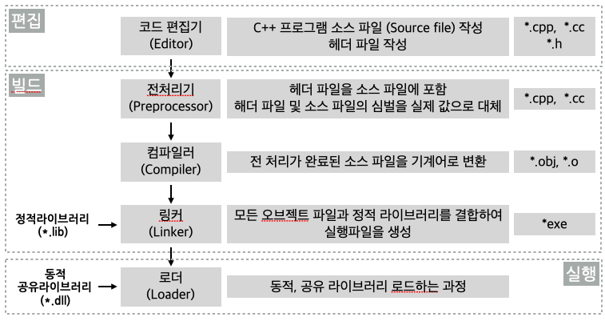

# 프로그램 개발 과정 및 실습

다음은 C++ 프로그래밍 언어를 사용하여 프로그램을 작성하고 실행파일을 만들고 실행파일을 싫행하는 전체 과정을 나타낸다. 

## 프로그램 개발 과정

* 편집

C++ 문법에 따라 소스코드를 작성하며 작성된 프로그램 코드를 소스 파일(source file)로 저장하며 소스파일의 학장자는 **.cpp** 또는 **.cc** 이며 
함수의 선언, 정의, 호출, 클래스 및 구조체 정의, 데이터를 저장하기 위한 저장 공간 할당을 위한 변수 선언 등을 포함한 알고리즘 기술하는 과정이다. 

* 빌드 

C++ 키워드와 문법에 따라 작성한 코드를 컴퓨터 CPU가 이해할 수 있는 기계어 코드로 변환을 하는 컴파일(comple) 과정과 컴파일된 기계어 코드와 프로그램 실행에 필요한 함수 또는 클래스의 코드의 묶음인 라이브러리(Library) 코드와 결합하여 실행 파일을 생성하는 링크(link) 과정으로 구성된다. 컴파일과 링크과정을 통해 **.exe**와 같은 실행파일을 생성하는 과정이다.

* 실행 

편집과 빌드를 통해 만들어진 실행 파일을 컴퓨터의 메모리에 로드하고 CPU가 메모리에 로드된 프로그램 코드 영역의 기계어 코드를 읽어 해석하여 해당 작업을 수행하여 소스 파일에 작성된 작업을 수행하는 과정이다. 

## MVS(MicroSoft Visual Studio)에서 C++ 프로젝트

* [C++ 콘솔 앱 프로젝트 만들기 및 편집](https://docs.microsoft.com/ko-kr/cpp/build/vscpp-step-1-create?view=msvc-150)

  - **[앱 프로젝트 만들기](https://docs.microsoft.com/ko-kr/cpp/build/vscpp-step-2-build?view=msvc-150#build-and-run-your-code-in-visual-studio)**: Visual Studio는 ‘프로젝트’를 사용하여 앱에 대한 코드를 구성하고 ‘솔루션’을 사용하여 프로젝트를 구성한다. 프로젝트에는 앱을 빌드하는데 필요한 모든 옵션, 구성 및 규칙이 포함된다.
    + Visual Studio에서 파일 메뉴를 열고 새 Project 를 선택하여 새 Project 대화 상자를 연다.
    + 새 Project 대화 상자에서 아직 선택하지 않은 경우 설치된 Visual C++ 을 선택한 다음 빈 Project 템플릿을 선택한다. 프로젝트 이름 필드에 HelloWorld를 입력한다. 확인을 선택하여 프로젝트를 만든다.
  
  - **[프로젝트를 콘손 앱으로 만들기](https://docs.microsoft.com/ko-kr/cpp/build/vscpp-step-2-build?view=msvc-150#build-and-run-your-code-in-visual-studio)**: 빈 프로젝트 템플릿은 Visual Stdio를 통해 만들려는 앱의 종류와는 관련이 없다. 콘솔 앱은 콘솔 또는 명령 프롬프토 창에서 실행되는 앱이다. 콘솔 앱을 만들기 위해서 콘솔 하위 시스템을 사용할 앱을 빌드하도록 Visual Studio메 명시적으로 지정하여야 한다.
    + Visual Studio에서 프로젝트 메뉴를 열고 속성을 선택하여 HelloWorld 속성 페이지 대화 상자를 연다.
    + 속성 페이지 대화 상자에서 구성 속성 링커 시스템을 선택한 후 다음 하위 시스템 속성 옆의 편집 상자를 선택한다. 표시되는 드롭다운 메뉴에서 콘솔(/SUBSYSTEM:CONSOLE)을 서택한다. 확인을 선택하여 변경 내용을 저장한다. 

  - **[소스 코드 파일 추가](https://docs.microsoft.com/ko-kr/cpp/build/vscpp-step-2-build?view=msvc-150#build-and-run-your-code-in-visual-studio)**
    + 솔루션 탐색기에서 HelloWorld 프로젝트를 선택한다. 메뉴 모음에서 프로젝트, 새 항몽 추가를 선택하여 새 항목 추가 대화 상자를 연다.
    + 아직 선택하지 않은 경우 새 항목 추가 대화 상자의 설치됨에서 VisualC++를 선택한다. 가운대 창에서 C++ 파일(.cpp 또는 .cc)을 선택한다. 이름을 HelloWorld.cpp로 변경한다. 추가를 선택하여 대화 상자를 닫고 파일을 만든다. 

  - **[소스 파일의 경로 추가](https://docs.microsoft.com/ko-kr/cpp/build/vscpp-step-2-build?view=msvc-150#build-and-run-your-code-in-visual-studio)**
    + 편집기 창에서 코드를 사용허거나 직접 입력을 한다. 

* [C++ 콘솔 앱 프로젝트 빌드 및 실행](https://docs.microsoft.com/ko-kr/cpp/build/vscpp-step-2-build?view=msvc-150)

  - **[Visual Studio에서 코드 빌드 및 샐행](https://docs.microsoft.com/ko-kr/cpp/build/vscpp-step-2-build?view=msvc-150#build-and-run-your-code-in-visual-studio)**
    + 프로젝트를 빌드하기 위해서 빌드 메뉴에서 솔루션 빌드를 선택한다. 출력 창은 빌드 프로세스의 결과를 보여준다.
    + 코드를 실행하려면 며뉴 모음에서 디버그, 디버깅하지 않고 시작을 선택한다. 

  - **[명령 창에서 코드 실행](https://docs.microsoft.com/ko-kr/cpp/build/vscpp-step-2-build?view=msvc-150#run-your-code-in-a-command-window)**: 일반적으로 Visual Studio가 아닌 명령 프롬프트에서 콘솔 앱을 살행한다. 

### 알아야 할 내용
* 프로그램 개발 절차 
  - 소스코드 작성
  - 전처리 
  - 컴파일 (결과 파일: 오브젝트 파일, 목적파일)
  - 링크 (결과 파일: 실행 파일)

