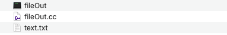
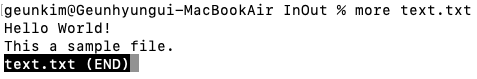

# 파일 입출력 스트림 

파일에 데이터를 읽고 쓰는 경우에도 스트림을 통해서 이루어진다. 
파일 스트림은 파일과 c++ 프로그램을 연결하는 스트림으로 입출력 스트림을 상속받은 겻으로 입출력 스트림의 기능 및 파일 관련 
기능을 제공한다. 즉 ```istream```클래스의 ```get()``` 메소드는  스트림이 키보드에 연결되어 있으면 키보드로 부터 
문자 하나를 읽고 스트림이 파일에 연결되어 있으면 파일에서 문자 하나를 읽는다. 이 외의 ```getline()```, ```read()```,
```put()```, ```write()``` 메소드도 연결된 스트림과의 데이터 읽기 쓰기를 수행한다. 

C++ 표준 파일 입출력 라이브러리의 핵심 클래스는 표준 입출력 라이브러리와 유사하게 ```ifstream```, ```ofstream```, ```fstream```클래스를 포함한다.
```ifstream```클래스는 은 파일 읽기 관련 기능을 ```ofstream``` 클래스는 파일 쓰기 관련 기능을 ```fstream``` 클래스는 파일 읽기와 쓰기 기능을 동시에 사용할 때 필요한 기능을 제공한다. 
이들 클래스는 템플릿 클래스인 ```basic_ifstrem```, ```basic_ofstream```, ```basic_fstream```를 
```char``` 자료형으로 구체화하고 ```typedef```로 재정의한 클래스이다. 
 

파일 스트림을 사용하기 위해서 C++ 프로그램은 아래와 같은 ```<fstream>``` 해더 파일을 포함하여야 한다.

```cpp
#include <fstream>
``` 

## 텍스트 파일과 바이너리 파일 

* **텍스트 파일**

파일은 디스크와 같은 저장 매체에 저장된 것으로 파일에 저장된 데이터의 종류에 따라 택스트 파일과 바이너리 파일로 구분된다. 
텍스트 파일은 우리가 사용하는 문자를 저장하는 문서 파일로 문서 편집기로 작성된 데이터 파일이다. 
우리가 사용하는 문자에는 한글, 영어 알파벳, 숫자, ?, !, . @ 등의 특수 문자가 있으며 각 문자마다 고유한 이진수 값(이진 코드)이 부여된다. 컴퓨터 등장 초기 영어 문자에 대한 이진 코드 체게는 ``ASCII`` 코드가 사용되었고 한글과 같이 영어를 제외한 
전 세계 언어의 각 문자에 2 바이트의 이진 코드 값을 부여하는 유니코드(unicode)라는 표준화된 이진 문자 코드 체계가 사용되고 있다. 

텍스트 파일의 예로는 ``C++와 같은 프로그램 소스 파일``, ``txt 파일``, ``HTML 파일``, ``XML 파일`` 등 이 있다.

텍스트 파일 편집기에서 사용자가 입력한 ```<return>``` 키는 파일에 ``'\r'(0x0D)``과 ``'\n'(0x0a)`` 제어코드 값이 파일에 저장된다. ``\r(carriage return)``은 커서를 현재 줄의 왼쪽 끝으로 이동시키는 코드이고 ``\n(line feed)``는 현재 있는 커서의 위치에서 한 줄 밑으로 옮기도록 한다.  

* **바이너리 파일**

바이너리 파일은 파일에 저장된 이진수 값 자체가 의미를 가지는 파일로 오디오 파일, 사진 파일, 그래픽 파일, 프로그램 실행 파일 등 문자로 해석되는 않는 파일이다. 바이너리 파일의 예로는 jpg, bmp, png 등의 이미지 파일, mp3 등의 오디오 파일, hwp, doc, ppt, xls 등의 확장자를 가진 파일과 컴파일된 오브젝트 파일로 확장자가 ``obj``, ``o``인 목적파일과 ``exe`` 확장자를 가진 실행 파일이 있다. 

### 파일 입출력 모드 

C++ 파일 입출력 시스템은 파일에 저장되는 데이터가 텍스트 문자 데이터 인지, 저장된 데이터가 문자 데이터가 아닌 이진수 값 자체가 의미를 가지는 바이너리 데이터 인지에 따라 
입출력 모드를 텍스트 I/O와 바이너리 I/O로 구분한다.
바이너리 I/O는 바이트 단위의 바이너리(이진) 데이터를 입출력하는 것으로 파일의 내용을 단순하게 이진수 바이트 스트림으로 다루기 때문에 텍스트 파일이나 바이너라 파일에 관겨없이 읽고 쓰기가 가능하다.

파일 입출력 모드는 ```ifstream```, ```ofstream```, ```fstream```의 객체 생성 시 지정하거나 파일 열기를 할 때 지정한다. 

#### 파일 모드(file mode)

파일 모드는 파일을 열 때 어떤 파일 입출력을 수행할 것인지 지정하는 정보이다. 파일 모드는 ```ios```클래스의 상수로 선언되어 있으며 읽기로 사용할 것인지, 쓰기를 사용할 것인지, 파일에 새로운 데이터를 추가할 것인지, 기존의 데이터를 삭제하고 처음부터 쓰기 시작할 것인지, 텍스트 I/O를 수행할 것 인지 바이너리 I/O로 할 것인지 지정할 수 있다. 

<table>
<th>파일 모드</th><th>의미 </th>
<tr><td>ios::in</td><td>읽기 모드로 파일 오픈</td></tr>
<tr><td>ios::out</td><td>쓰기 모드로 파일 오픈</td></tr> 
<tr><td>ios::binary</td><td>파일을 바이너리 I/O로 연다. 이 것이 설정되지 않은면 텍스트 I/O로 파일을 연다.</td></tr> 
<tr><td>ios::app</td><td>쓰기 모드롤 파일을 여는 경우에만 사용되는 것으로 데이터를 파일 쓸 때마다 데이터를 쓰기 전에 파일의 포인터를 파일의 끝으로 설정한다.</td></tr> 
<tr><td>ios::trunc</td><td>파일을 열 때 파일이 존재하면 내용을 모두 지운다. ios::out 모드를 지정하면 이 것도 함께 지정된다.</td></tr> 
<tr><td>ios::ate</td><td>파일을 오픈할 때 파일포인터를 파일의 끝으로 설정한다.</td></tr>
<tr><td>ios::nocreate</td><td>파일을 여는 것을 시도하지 않고 파일의 존재 여부만 확인하는 모드로 파일이 존재하지 않으면 에러를 생성한다. </td></tr> 
<tr><td>ios::noreplace</td><td>nocreate와 반대로 파일이 존재하면 에러를 발생한다.</td></tr> 
</table>

#### 파일 모드 설정 방법

파일 모드는 파일을 열 때 지정한다. 즉 ```open()``` 함수나 ```ifstream```, ```ofstream```, ```fstream``` 클래스의 
생성자를 호출할 때 지정한다. 
```open()```함수를 호출할 때 다음과 같이 두 번 째 파러미터로 설정할 파일 모드를 전달한다.

```cpp 
void open(const char* filename, ios::openmode mode);
```

여기서 ```mode```는 앞의 표에 있는 상수이다. 여러 모드를 동시에 지정하고자 할 경우 다음과 같이 ``bit-OR(|)`` 연산자를 이용한다.

```cpp 
ios::in | ios::binary 
```

```ifstream```클래스의 디폴트 파일 모드는 ```ios::in```이고 ```ofstream```클래스의 디폴트 파일 모드는 ```ios::out```이다. ```fstream```클래스의 디폴트 파일 모드는 ```ios::in | ios::out``` 이다.  


## 파일에 데이터 쓰기 

파일에 데이터를 쓰기 위해서는 다음의 과정을 수행한다. 

* 먼저 파일 쓰기를 위한 스트림 객체를 생성한다.  
* 생성한 쓰기용 스트림 객체를 통해 쓰기를 할 파일을 연다.
    - 파일 쓰가가 성공적으로 이루어졌는지 확인하는 것이 필요하다. 
    - 시스템에 열고자 하는 파일 이름이 없는 경우에는 새로운 파일을 생성하고 파일을 연다.
* ```<<``` 연산자를 이용하여 데이터를 파일에 쓴다.  
* 파일에 데이터 쓰기를 완료하면 파일을 닫는다.


## 파일에 데이터 출력

### 파일 쓰기를 위한 파일 스트림 객체 생성 

텍스트 데이터를 파일로 저장하기 위해서 ```ofstream``` 클래스(파일 출력 스트림 클래스)의 객체를 생성한다. 
다음은 ```ofstream```클래스의 객체 ```fout```를 생성하는 프로그램 코드이다.

```cpp 
ofstream fout; 
```

```fout``` 객체가 생성되었기 때문에 이것을 이용하여 파일에 데이터 쓰기를 할 수 있다.
앞에서 생성한 파일 스트림에 대해 쓰기를 할 파일이 지정되지 않아 특정 파일에 대해서 ``파일 열기``를 하여야 한다.


### 파일 열기 

파일 스트림이 생성된 후 특정 파일을 열어 파일 스트림에 연결하기 위해서 파일 스트림의 ```open()``` 멤버 함수를 호출한다.
```open()```   멤버 함수의 매개 변수로 데이터를 쓸 파일 이름을 전달한다.
다음은 ```fout```파일 스트림을 통해 ``test.txt`` 파일을 여는 프로그램 코드이다. 

```cpp
fout.open("text.txt");
```

``text.txt`` 파일을 열 때 ``text.txt`` 파일이 없는 경우 새로운 파일을 생성하고 파일이 존재하는 경우 이미 저장된 파일의 내용을 모두 지우고 파일을 처음부터 데이터를 쓸 수 있도록 한다. 

파일 열기를 다음과 같이 파일 스트림 클래스의 생성자를 호출해서 파일 스트림의 생성과 파일을 열고 스트림과 파일을 연결한다.

```cpp
ofstream fout("text.txt");  //파일 스트림 생성과 파일 열기를 동시에 수행
``` 

파일에 데이터를 쓰기 위해서 매개변수로 지정한 파일을 열 때 지정된 파일이 읽기 전용이거나 디스크에 여유 공간이 없어 파일을 만드는 것이 만드는 것이 불가능할 경우
파일 열기가 실패하게 된다. 파일 열기가 정상적으로 이루어졌는지 확인은 ```is_open()``` 멤버 함수, ```fail()```멤버 함수와 ```operator !()``` 연산자를 이용한다. 

### 파일 열기 성공 멤버 함수 및 연산자 

* ```is_open()```: ``ofstream`` 클래스의 멤버함수로 파일 열기가 성공하였으면 ```is_open()``` 함수는 ``true``를 실패하였으면 ``false``를 반환하다.

```cpp
if(!fout.is_open()) {
    // 파일 열기가 실패한 경우 처리할 코드를 
}
```

 * ```fail()```: ```ios```클래스의 멤버함수로 파일 열기가 성공하면 ``false``를 실패하면 ``true``를 반환한다.

```cpp
if(fout.fail()) {
    // 파일 열기가 실패한 경우 처리할 코드를 
}

```

* ```operator!()```: ```ios```클래스의 멤버 연산자로 파일 열기가 성공하였으면 ``true``를 실패한 경우 ``false``를 반환한다. 

```cpp
if(!fout) {
    // 파일 열기가 실패한 경우 처리할 코드를 
}
```

### 파일 닫기

파일 쓰기를 한 후 ```close()``` 멤버 함수를 호출하여 파일을 닫는다. 이 때 파일 스트림과 파일과의 연결이 끊긴다.
다음은 ```close()```멤버 함수를 통해 ```fout``` 파일 스트림과 파일과의 연결을 끊는 프로그램 코드이다.

```cpp
fout.close();  
```

```close()``` 함수가 호출되어 ```fout``` 파일 스트림과 파일과의 연결이 끊긴 후 에는 ```fout```을 통해 파일 쓰기를 할 수 없다. 
다시 ```open()``` 함수를 통해 쓰기를 할 파일을 열어 파일 스트림과 파일을 연결하여야 한다. 

### 파일 쓰기 예제

다음은 실행 파일이 있는 디렉토리에 있는 ``text.txt`` 파일을 열거나 ``text.txt`` 파일을 생성하고 ```fout``` 스트림과 연결하고 ``Hello World!`` 문자열을 ``text.txt``에 저장한다. 
파일에 데이터를 저장하기 위해서는 파일 스트림 객체 ```fout```을 이용하여야 한다.   

```cpp
// File name: fileOpen.cc
//
#include <iostream>
#include <fstream>
using namespace std;

int main(int argc, char const *argv[])
{
    ofstream fout("text.txt");  

    if(!fout) {
        cout << "[Error] file open" << endl;
    }
    
    fout << "Hello World!" << endl;
    fout << "This a sample file." << endl;
    fout.close();
    return 0;
}
```

다음은 ``fileOut.cc`` 소스 파일, 실행 파일 ``fileOut``, 쓰기용 파일로 생성된 ``text.txt`` 파일이 있는 디렉토리를 나타낸다.



다음은 ``text.txt`` 파일의 내용으로 ``Hello World`` 문자열과 ``This is a smple file.`` 문자열 두 개가 줄 바꿈으로 구분이 되어 저장됨을 확인할 수 있다. 



## 파일의 데이터 읽기 

파일의 데이터를 읽는 과정도 파일에 데이터를 쓰는 과정과 유시하며, 파일의 데이터를 읽어오기 위해서 다음의 과정이 요구된다. 

* 먼저 파일 읽기를 위한 스트림 객체를 생성한다.  
* 생성한 읽기용 스트림 객체를 통해 읽기를 할 파일을 연다.
	- 파일 열기가 성공적으로 이루어졌는지 확인하는 것이 필요하다. 
	- 시스템에 열고자 하는 파일 이름이 없는 경우에는 에러를 에러를 생성한다.
* ```>>``` 연산자를 이용하여 파일로 부터 데이터를 읽는다.  
* 더 이상 파일의 데이터가 필요하지 않은 경우 파일을 닫는다. 

### 파일 읽기를 위한 파일 스트림 객체 생성 

파일의 데이터를 읽기 위한 파일 스트림 객체는 ```ifstream``` 클래스(파일 입력 스트림 클래스)의 객체이다.  
다음은 ```ifstream```클래스의 객체 ```fin```을 생성하는 프로그램 코드이다.

```cpp
ifstream fin;
```

```fin``` 객체가 생성되었기 때문에 이것을 이용하여 파일의 데이터를 읽을 수 있다.
앞의 파일 스트림도 읽기를 할 파일이 지정되지 않아서 ``파일 열기`` 가 이루어 져야 한다.


### 파일 열기 

다음은 ```fin```파일 스트림을 통해 ``test.txt`` 파일을 여는 프로그램 코드이다. 

```cpp
fin.open("text.txt");
```

### 파일 읽기 예제

다음은 실행 파일이 있는 디렉토리에 있는 ``text.txt`` 파일을 읽기 모드로 열어 파일의 데이터를 한 줄씩 읽어서 
문자열 버퍼에 저장한 후 화면에 출력하는 프로그램 코드이다.  
파일에서 데이터를 읽어 데이터를 저장하기 위해 문자형 배열 buf를 다음과 같이 ```char buf[255];``` 선언한다.
```ifstream```의 객체 ``fin``을 통해 ``text.txt`` 파일을 연다. 
```fin``` 객체를 통해 파일 내의 한 줄을 읽어 ``buf`` 배열에 저장한 후 표준 출력 객체 cout을 사용하여 화면에 출력하고 다음 한 줄을 읽어 ``buf`` 배열에 저정한 후 화면에 출력한다. 


```cpp
// fileIn.cc
//
#include <iostream>
#include <fstream>
using namespace std;

int main(int argc, char const *argv[])
{
    char buf[255];
    ifstream fin("./text.txt");
    if(!fin) {
        cout << "[Error] text.txt file open" << endl;
        return 0;
    }
    fin >> buf;
    cout <<"1: " << (buf) << endl;
    fin >> buf;
    cout <<"2: " << (buf) << endl;
    fin.close();
    return 0;
}
```

앞의 프로그램을 실행한 결과는 다음과 같다. 

1: Hello World!

2: This a sample file.

다음은 앞의 프로그램 예제를 ```istream``` 클래스의 ```getline(char* line, int n)```멤버 함수를 이용하여 ``text.txt`` 파일의 내용을 한 줄씩 읽어 화면에 출력하는 프로그램 코드이다

```cpp
#include <iostream>
#include <fstream>

using namespace std;

int main(int argc, char const *argv[])
{
    ifstream fin("text.txt");
    char buf[255];
    if(!fin) {
        cout << "[Error] text.txt file open" << endl;
        return 0;
    }
    while(true){
        fin.getline(buf, 255);
        if(fin.eof()) break;
        cout << i << ": " << (buf) << endl; 
        i++;
    }
    fin.close();
    return 0;
}
```

앞의 프로그램 코드의 결과는 다음과 같다. 

1: Hello World!

2: This a sample file.

```istream``` 클래스의 ```getline(char* line, int n)```멤버 함수 대신 ``string``클래스를 활용하여 파일에서 데이터를 읽어오기 위해서 ```getline(ifstream fin, string line)``` 함수가 있다. 이 ```getline()``` 함수는 
``string`` 클래스와 관련한 것으로 ```<string>``` 헤더 파일에 선언되어 있다. 이는 파일에서 한 줄을 읽어 ```string```객체에 저장한다. ```string``` 객체를 사용하면 파알의 한 줄을 구성하는 문자의 개수를 고려하지 않아도 된다. 


