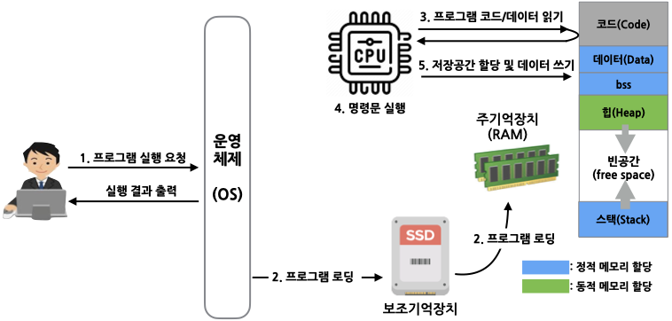

# 프로그램 메모리 구조

## 프로그램 실행

컴퓨터에서 실행파일이 실행되기 위해서는 하드디스크와 같은 보조 기억장치에 저장된 실행파일(실행 프로그램)을 주 기억 장치인 메모리(RAM: Random Access Memory)에 로드되어야 한다.
여러 프로그램이 실행되는 컴퓨터 환경에서는 운영체제가 보조 기억장치에 저장된 실행파일을 메모리에 로드한다.

운영체제는 실행파일을 로드될 메모리 영역을 코드(Code) 영역, 데이터(Data) 영역, BSS(Block Stateed Symbol) 영역, 힙(Heap) 영역, 스택(Stack) 영역으로 나누어 관리한다.

사용자가 프로그램 실행을 요청하면 운영체제는 보조 기억장치에서 프로그램 관련 코드와 데이터를 주 기억장치에 로딩한다.
프로그램에 메모리에 로딩되면 CPU는 프로그램 코드의 명령어를 순차적으로 읽어와서 명령어를 해석하고 수행한다. 명령어에 따라 데이터를 저장할 저장 공간을 스택이나 힙 영역에 할당하고 메모리에 데이터를 쓰거나 저장된 데이터를 읽어오면서 프로그램을 실행한다.    


 
## 코드 영역

코드 영역은 실행 프로그램을 구성하는 **코드(명령어:instruction)**와 **전역 상수**를 저장하는 영역으로 텍스트 영역이라고도 한다. 
CPU는 코드 영역의 명령어를 하나씩 순차적으로 가져와서 실행한다. 
명령어에는 다양한 연산 기능, 함수 호출 기능, 데이터 공간 할당 기능 등이 있으며, 전역 상수에는 ```const``` 키워드로 선언된 변수, ``" "``로 선언된 문자열 상수 등이 있다. 
이 코드 영역의 데이터는 읽기 전용(read only)으로 절대 변경되지 않아야 한다.

## 데이터 및 BSS 영역

데이터 영역은 프로그램의 **전역 변수**와 **정적(static) 변수**, 배열, 구조체 등이 저장되는 영역이다. 프로그램의 실행과 함께 저장공간이 할당되며 프로그램이 종료되면 해제된다.
데이터 영역에는 초기화된 정적 변수와 전역 변수가 저장된다.
BSS 영역은 초기화되지 않은 전역 변수, 0으로 초기화된 전역 변수, 초기화되지 않은 정적 변수, 0으로 초기화된 정젹 변수가 저장되는 영역으로 이 영역의 모든 변수는 0으로 초기화된다.
데이터 영역과 BSS 영역의 크기는 컴파일 시 정해진다.
함수 내에서 선언된 정적 변수는 프로그램이 실행될 때 저장 공간만 할당되고 함수가 실행될 때 초기화 된다. 

## 힙 영역

힙 영역은 사용자가 직접 관리해야만 하는 메모리 영역이다. 사용자에 의해 메모리 공간이 동적으로 할당되고 해제된다(C++의 new() 함수를 사용한다). 힙 영역은 할당 순서에 따라 할당되는 주소 값이 낮은 주소 값에서 높은 주소 값으로 커진다.
힙 영역의 데이터는 메모리 주소 값에 의해서만 참조되고 사용된다. 그러므로 힙 영역은 포인터 변수를 통해서 참조된다.


## 스택 영역 

스택 영역은 함수 내 지역 변수(local variable), 매개 변수(parameter), 함수 리턴 주소, 반환 값 등 
함수가 실행될 때 저장 공간이 할당되고 함수 실행이 종료되면 저장 공간이 해제되는 데이터가 저장되는 영역이다. 
함수의 호출과 함께 할당되며, 함수의 호출이 완료되면 소멸한다.
지역 변수와 매개 변수를 위한 저장 공간이 임시 할당되는 공간이다(auto, cpu 메모리에 들어가지 못한 register 변 등). 
먼저 선언된 데이터를 위한 저장 공간이 가장 나중에 해제된다.
스택 영역의 크기는 고정되어 있고 프로그램이 실행 중에는 크기를 변경할 수 없다. 

힙 영역과 스택 영역은 프로그램이 실행 중에 저장 공간을 할당/해지가 정적 또는 동적으로 이루어지기 때문에 프로그램이 실행 중에 힙 영역과 스택 영역을 지속적으로 할당하여 사용할 경우 메모리 부족 현상이 발생할 수 있다. 


예제 코드
```cpp
#include <iostream>
using namespace std;

extern int num004 = 10;

void fun(int a) {
    auto num001 = a;
    int num002 = a;
    static int num003 = a;
    register int num005 = a;

    // 각 변수들의 값과 주소값을 출력합니다.
    printf(" auto   num001 = %d, &num001 = %d \n", num001, &num001);
    printf("        num002 = %d, &num002 = %d \n", num002, &num002);
    printf(" static num003 = %d, &num003 = %d \n", num003, &num003);
    printf(" extern num004 = %d, &num004 = %d \n", num004, &num004);
    printf(" register  num005 = %d, &num005 = %d \n", num005, &num005);
}

int main()
{
    fun(10);

    return 0;
}
```
실행 결과
``
 auto   num001 = 10, &num001 = 9434804
        num002 = 10, &num002 = 9434792
 static num003 = 10, &num003 = 1880404
 extern num004 = 10, &num004 = 1880064
 register  num005 = 10, &num005 = 9434780
``
auto, 미표기, register 변수는 높은 공간에 존재하고, static, extern 변수는 낮은 공간에 존재한다.
일반적인 지역변수는 auto 변수처럼 작동한다. register변수는 주소를 사용해버려서 auto 변수처럼 작동한다.
extern과 static 변수는 데이터/bss 영역에 들어갔을 것으로 추론할 수 있다.

register 변수에 대한 추가 정보
* register 변수는 CPU에 들어가는 변수의 개수가 제한적이여서 컴파일러에게 register 제안이 무시될 수 있다.
* C++11에서는 register 키워드가 앞으로 사용되지 않을 것이다.
* C언어에서는 register의 주소값이 없으므로 가지고 올 수 없다. 다만 C++에서 이 제한이 사라져 주소를 사용하면 이 변수가 register 변수로 되지 않도록 보장된다.

### 스택 오버플로우

데이터를 정적할당할 때 힙 또는 스택에 저장할 수 있는데,
스택은 일반적으로 CUP 캐시에 있는 것처럼 선호되므로 스택에 저장된 객체와 관련된 작업이 더 빠른 경향이 있다.
그러나 스택은 용량이 어느 정도로 한정되어있다. 만약에 스택에 들어간 변수들중 일부의 크기가 너무 커져버리면
스택 영역에 있어야 할 지역변수의 공간이 인접한 다른 메모리 영역을 침범하게 되어 메모리 접근 오류가 발생하게 된다.