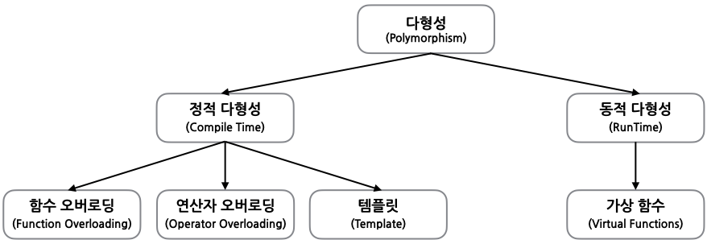
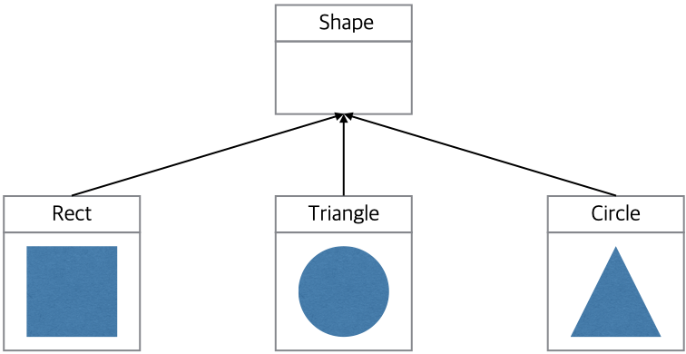

# Polymorphism(다형성) 이란

다형성(Polymorphism)이라는 단어는 많은 형태를 갖는다는 것을 의미한다.
간단히 말하면, 하나 이상의 형태로 표시되는 메시지의 능력으로 다형성을 정의할 수 있다. 실 생활에서 다형성의 예로 아버지, 남편, 직원의 역할을 하는 남자이다. 
따라서 같은 사람이 환경에 따라 다른 역할(특성)을 한다는 것이 다형성이다. 

객체지향 프로그래밍에서 다형성은 중요한 기능 중 하나이다.
C++ 언어에서 다형성은 크게 정적 다형성, 동적 다형성 두가지로 구분된다.
* 정적 다형성 (컴파일 시 다형성: Compile time Polymorphism)
	- 함수 오버로딩 (function overloading)
	- 연산자 오버로딩 (operator overloading)
	- 템플릿 (template)
* 동적 다형성 (런타임 다형성: Runtime polymorphism)
	- 함수 오버라이딩(function overriding) 



객체지향 프로그래밍에서는 다양한 객체에게 동일한 메시지를 보내도 각 객체들이 서로 다르게 동작을 하는 특성을 뜻한다.

함수 오버로딩은 함수의 이름이 같아도 함수의 입력 인자의 개수가 다르거나 인자의 자료형이 다른 경우 함수들은 이름이 같아도 입력 인자의 자료형과 개수가 다름에 따라 다른 동작을 한다. 

연산자 오버로딩은 클래스에서 기존의 연산자를 새롭게 재 정의해서 사용하는 것으로 대표적인 예가 ```string```클래스의 **+** 연산자로 정수의 더하기 기능이 아는 두 문자열을 이어서 새로운 string을 생성하는 기능을 한다.

이번 장에서 학습할 동적 다형성은 상속에 따른 함수의 오버라이딩으로 이루어지는 것으로 상속의 관계일 때 이루어 진다. 
함수 오버라이딩(function overriding)은 자식 클래스가 부모 클래스의 멤버 함수를 재 정의하는 것으로 자식 클래스의 멤버 함수가 오버라이딩되었다고 말한다. 
여러 자식 클래스가 동일한 부모 클래스를 상속하면 부모 클래스의 기능(멤버 함수)이 여러 자식 클래스로 상속되기 때문에 자식 클래스들도 같은 기능(멤버 함수)을 가진다. 동적 다형성은 부모 클래스의 객체가 상황에 따라 자식 클래스의 자료형(클래스)으로 해석되어 자식 클래스에 적합한 기능을 수행하는 것이다. 

```cpp
#include <iostream>
using namespace std;

class Base
{
public:
	virtual void print() {
		cout << "print() in base class" << endl;
	}
	void show() {
		cout << "show() in base class" << endl;
	}
};

class Derived : public Base
{
public:
	void print() {
		cout << "print() in derived class" << endl;
	}
	void show() {
		cout << "show() in derived class" << endl;
	}
};

int main(int argc, char const *argv[])
{
	Base b, *bptr;
	Derived d;

	b.print(); // Base 클래스의 print() 함수 호출
	d.print(); // Derived 클래스의 print() 함수 호출

	bptr = &d;     // Derived의 객체 d를 Base 자료형의 포인터 변수에 저장
	bptr->print(); // Base 포인터 변수를 통해 Derived 객체의 print() 함수 호출
	bptr->show();  // Base 포인터 변수를 통해 Base 객체의 show() 함수 호출

	return 0;
}
```
프로그램 실행 결과는 다음과 같다. 
```bptr = &d;``` 를 통해서 ```Base``` 포인터 변수에  ```Derived``` 객체를 지정하는 **상향 형변환(up-casting)**을 수행한다. 
Base의 객체를 저장할 수 있는 ```bptr``` 포인터 변수에 ```Derived```의  객체 ```d```의 주소를 저장한다.  
```bptr->print();```와 ```bptr->show()```의 결과는 다른 객체의 멤버 함수를 호출하게 된다. 
```bptr->print();```은 자식 클래스인 ```Derived``` 클래스의 ```print()``` 멤버 함수를 호출하고
```bptr->show();```는 부모 클래스인 ```Base``` 클래스의 ```print()``` 멤버함수를 호출하게 된다.  

``
print() in base class
print() in derived class
print() in derived class
show() in base class
``

동적 다형성이 가능하도록 하는 개념으로 **가상 함수**, **상향 형변환**, **동적 바인딩**이 있다.

## 상향 형변환(Up-Casting) 

동적 다형성은 객체를 가리키는 포인터인 객체 포인터를 통해 이루어진다. 
도형을 ```Shape```, 사각형은 ```Rect```, 삼각형은 ```Triangle```, 원은 ```Circle```으로 모델링할 수 있다. 
```Rect```, ```Triangle```, ```Circle```클래스는 ```Shape``` 클래스를 상속한다. 
이들 클래스의 상속 계층 구조는 다음 그림과 같다.



포인터 변수를 선언할 때 포인터 변수에 저장한 주소에 포인터 변수의 자료형에 해당하는 데이터가 저장된다.
즉 ```Rect``` 객체의 포인터 변수는 ```Rect``` 타입의 객체만을 가리키고, ```Triangle``` 객체와 ```Circle```객체의 포인터 변수는 각각 ```Triangle``` 타입과 ```Circle``` 타입의 객체만을 가리킨다. 
다음과 같이 부모 클래스의 객체 포인터를 사용하여 자식 클래스의 객체를 가리키는 경우 어떻게 처리되는지 확인해보자.

```cpp
Shape *pShape = new Circle(); 
```
앞의 프로그램 코드는 에러가 발생하지 않는다. 
이를 해석하기 위해서는 자식 클래스의 객체를 생성할 때 부모 클래스의 생성자와 자식 클래스의 생성자가 생성되는 순서가 부모 클래스 다음에 자식 클래스 순이다. 즉 부모 클래스가 생성된 후에 자식 클래스가 생성된다.

상향 형변환 후에는 부모 클래스에서 자식 클래스의 메소드(클래스의 멤버 함수)에 접근할 수가 없다. 부모 클래스의 포인터/참조값에는 자식 클래스의 객체의 주소를 담을 수 있지만 그 반대 상황인 자식 클래스의 포인터/참조값에 부모 클래스의 객체 주소는 담을 수 없다.

## 하향 형변환(Down-Casting)
자식 클래스의 포인터에 부모 클래스의 객체가 자식 클래스의 형으로 캐스팅되는 것으로 명시적, 암시적 캐스팅이라고도 한다.

형변환 과정에서 데이터의 일부가 잘리는 경우도 생긴다. double 자료형인 데이터가 int 자료형으로 된다. 대입된다면 소수점 이하의 데이터가 질리게 된다.
