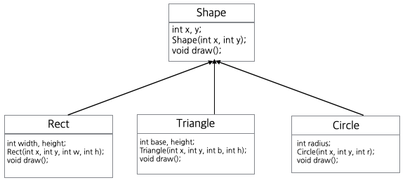

# 다형성, 가상함수, 순수가상함수, 추상클래스


1. 다형성의 예로 Rect, Triangle, Circle 클래스가 다음과 같이 상속관계에 있다.



* 각 클래스를 정의하고 클래스의 객체를 생성한 후 클래스의 메소드를 확인하시오.

* Shape \*buf[10];을 선언한 후 buf 배열에 Rect, Triangle, Circle 클래스의 객체들을 저장한 후 객체의 동작을 다형성을 활용해서 확인하시오. 


* Shape buf[10];을 선언한 후 buf 배열에 Rect, Triangle, Circle 클래스의 객체들을 저장한 후 객체의 동작을 다형성을 활용해서 확인하시오. 

* 프로그램이 종료되면 모든 자원에 제거될 수 있도록 클래스를 보안하시오.

2. 위의 실습에서 Shape 클래스의 draw() 멤버함수를 순수 가상 함수롤 선언하여 추상 클래스로 만든 후 같은 실습을 하시오.

3. 다음 코드의 실행 결과를 확인하시오. 

 ```cpp
 #include "iostream"
using namespace std;

class Parent
{
	int x;
public:
	void ofn() {}
	virtual void fn() { cout << "parent fn" << endl;}
};

class Child: public Parent
{
public:
	void fn() {
		cout << "child fn" << endl;
	}
};


int main(int argc, char const *argv[])
{
	Parent *p = new Parent();
	Parent *p1 = new Child();
	p->fn();
	p1->fn();

	return 0;
}
```

4. 다음 코드를 실행시키고 결과를 분석한후 parent2의 fn()함수를 호출할 수 있도록 프로그램을 수정하시오.

```cpp
#include "iostream"
using namespace std;

class Parent1
{
public:
	int x;
	void fn() {
		cout << "Parent1's fn" << endl;
	}
};

class Parent2
{
public:
	int x;
	void fn() {
		cout << "Parent2's fn" << endl;
	}
};


class Child : public Parent1, public Parent2
{
};

int main(int argc, char const *argv[])
{
	Child obj;
	obj.Parent1::fn();

	return 0;
}
```

5. 다음 프로그램 코드를 컴파일 하면 두 개의 에러가 발생한다.  [foo() 함수는 순수 가상함수이어야 한다.]

```cpp
#include <iostream>

class A {
public:
    virtual void foo() = 0; // 순수 가상함수
};

class B : public A {

};

int main(void) {

    A a;    // (1) 에러 발생
    B b;    // (2) 에러 발생 
    return 0;
}
```

6. 다음 프로그램의 main() 함수에 다형성과 오버라이딩 활용한 프로그램 코드를 작성하시오. 

```cpp
#include <iostream>
#include <string>

using namespace std;

class Base {
  string s;

 public:
  Base() : s("기반") { cout << "기반 클래스" << endl; }

  void what() { cout << s << endl; }
};
class Derived : public Base {
  std::string s;

 public:
  Derived() : s("파생"), Base() { cout << "파생 클래스" << endl; }

  void what() { cout << s << endl; }
};

int main(int argc, char const *argv[])
{

	return 0;
}
```

7. 다형성, 추상 클래스를 이용한 샘플 프로그램을 작성하고 교수의 github 의 SampleCodes/Polymorphism/으로 pull request하시오.

8. SampleCodes/Polymorphism/ 의 샘플 코드를 실행하고 결과를 분석하시오.