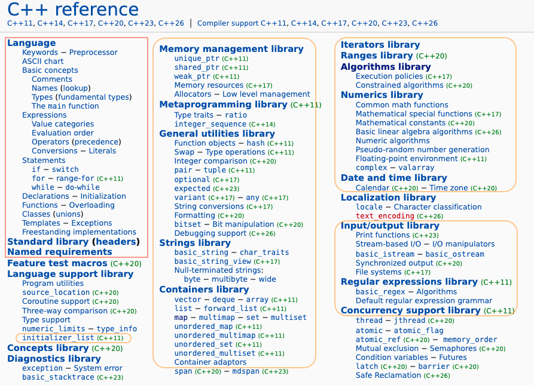

# CPPLectures

## C++ Standard version lists

* C++98, C++03, [C++11](https://en.cppreference.com/w/cpp/11), [C++14](https://en.cppreference.com/w/cpp/14), [C++17](https://en.cppreference.com/w/cpp/17), [C++20](https://en.cppreference.com/w/cpp/20), [C++23](https://en.cppreference.com/w/cpp/23) ([reference](https://en.cppreference.com/w/))

## 공통 사항

* [코딩 스타일(Coding Style)](./CodingStyle.md)
* [github - Pro Git book](https://git-scm.com/book/ko/v2): Pro Git book의 한글 버전
* Visual Studio에 및 C++ 지원 설치 및 간단한 C++ 프로젝트 만들기
    - [Microsoft Visaul Studio 2017 설치](https://docs.microsoft.com/ko-kr/cpp/build/vscpp-step-0-installation?view=msvc-150)
    - C++를 사용한 데스크톱 개발 워크로드 선택한 다음 설치

## Part 1

### **[C++ 기초](./CppBasic)**
   - [컴퓨터와 프로그래밍(프로그래밍 언어 개념)](./CppBasic/ProgrammingLanguage.md)
   - [기본 C++ 프로그래밍 언어 요소](./CppBasic/Basic.md) 
   - [키보드 입력 및 콘솔 출력](./CppBasic/InOut.md)
   - [전처리기(Preprocessor)](./CppBasic/Preprocessor.md)
   - [프로그램 개발 과정](./CppBasic/ProgramDev.md)
   - [개념(Concept)](./CppBasic/Concept.md)
   - [프로그램 실습](./CppBasic/Labs.md)
   - [프로그램 문제](./CppBasic/Problems.md)

### **[프로그래밍 기초](./BasicProgramming)**
   - [변수, 상수, 컴퓨터의 데이터 표현](./BasicProgramming/Data_and_Variables.md)  
   - [자료형, 자료형 의미, 종류](./BasicProgramming/DataType.md)
   - [변수의 사용](./BasicProgramming/VariableUsage.md)
   - [연산자와 연산자 우선순위](./BasicProgramming/Operators.md)
   - [프로그램 실습](./BasicProgramming/Labs.md)
   - [프로그램 문제](./BasicProgramming/Problems.md)

### **[제어문](./Control)**
   - [조건문](./Control/condition.md)
   - [반복문](./Control/Iteration.md)
   - [프로그램 실습](./Control/Labs.md)
   - [프로그램 문제](./Control/Problems.md)

### **[배열](./Array)**
   - [배열이 필요한 이유](./Array/whyArray.md)
   - [배열 선언 및 초기화](./Array/Declaration_Initializaion.md)
   - [배열의 사용](./Array/AccessArrayElements.md)
   - [배열과 문자열](./Array/charArray.md)
   - [다차원 배열](./Array/multiDimArray.md)
   - [프로그램 실습](./Array/Labs.md)
   - [프로그램 문제](./Array/Problems.md)

### **[함수](./Function)**
   - [함수관련 용어](./Function/Concept.md)
   - [함수 호출](./Function/functionCall.md)
   - [디폴트 매개 변수](./Function/defaultArgumentr.md)
   - [inline 함수](./Function/inline.md)
   - [가변 매개변수 함수](./Function/variadic.md)
   - [프렌즈 함수](./friend_function_class.md)
   - [함수 오버로드](./Function/overload.md)
   - [함수 템플릿](./Template/functionTemplate.md)
   - [람다 표현](./Function/LambdaExpression.md)
   - [프로그램 실습](./Function/Labs.md)
   - [프로그램 문제](./Function/Problems.md)

### **[포인터 변수](./Pointer)**
   - [메모리와 주소](./Pointer/Memory_Address.md)
   - [포인터 변수](./Pointer/PointerVariables.md)
   - [포인터 관련 연산자](./Pointer/PointerOperator.md)
   - [이중 포인터](./Pointer/DoublePointer.md)
   - [스마트 포인터](./SmartPointer)
   - [프로그램 실습]
   - [프로그램 문제]
 
   
### **[구조체, 공용체, 열거형](./Struct)**
   - [구조체](./Struct/Struct.md)
   - [공용체](./Struct/Union.md)
   - [열거형](./Struct/Enum.md)
   - [프로그램 실습](./Struct/Labs.md)
   - [프로그램 문제](./Struct/Problems.md)

### **[메모리 모델과 이름 공간](./MemoryModelAndNameSpace)**
   - [메모리 모델](./MemoryModelAndNameSpace/Memory_Model.md)
   - [변수의 유효범위와 생명주기](./MemoryModelAndNameSpace/Scope_LifeCycle.md)
   - [이름 공간](./MemoryModelAndNameSpace/NameSpace.md)
   - [프로그램 실습](./MemoryModelAndNameSpace/Labs.md)
   - [프로그램 문제](./MemoryModelAndNameSpace/Problems.md)

## Part 2

### **[클래스 - 구조체의 진화](./Class)**
   - [클래스와 객체](./Class/Objects.md)
   - [생성자와 소멸자](./Class/constructor_destructor.md)
   - [정적 클래스](./Class/Static.md)
   - [프렌즈 클래스](./friend_function_class.md)
   - [임시 객체](TemporaryClass.md)
   - 프로그램 실습
   - 프로그램 문제

### **[클래스와 상속](./Inheritance)**
   - [상속의 개념](./Inheritance/Concept.md)
   - [자식 클래스 정의하기](./Inheritance/ChildClass.md)
   - [상속과 접근 지정자](./Inheritance/AccessControl.md)
   - [상속과 생성자 소멀자 관계](https://github.com/Hongyoosung/Cpp-Learning/blob/master/Inheritance/Protected.md)
   - [다중 상속](./Inheritance/MultipleInheritance.md)
   - 프로그램 실습
   - 프로그램 문제
   
### **[다형성](./Polymorphism)**
   - [다형성의 개념](./Polymorphism/Concept.md)
   - [가상함수와 동적바인딩](./Polymorphism/VirtualFunction.md)
   - [가상 소멸자](./Polymorphism/virtual_destructor.md)
   - [순수 가상함수](./Polymorphism/pureVirtualFunc.md)
   - 프로그램 실습
   - 프로그램 문제
   
### **[중복](./Overload)**
   - [함수 중복]
   - [함수 중복의 원칙](./Overload/FunctionOverload.md)
   - [연산자 중복](./Overload/OperatorOverload.md)
   - [연산자 중복의 가이드라인](./Overload/OverloadingGuidelines.md)
   - 프렌드와 연산자 중복
   - 프로그램 실습
   - 프로그램 문제
 
### **[에외처리와 형 변환](./Exception)**
   - [프로그램의 에러종류](./Exception/Errors_in_Program.md)
   - [예외의 개념](./Exception/Exception.md)
   - 에외 처리기
   - 예외 전달 방법
   - 다중 catch 문장
   - 프로그램 실습
   - 프로그램 문제
    
### **[스마트 포인터](./SmartPointer)**
   - [스마트 포인터 개념](./SmartPointer/SmartPointer.md)
   - [Unique Pointer](./SmartPointer/unique_ptr.md)
   - [Shared Pointer](./SmartPointer/shared_ptr.md)
   - [Weak Pointer](./SmartPointer/weak_ptr.md)
   - 프로그램 실습
   - 프로그램 문제   
   
### **[템플릿](./Template)**
   - [템플릿 개념](./Template/template.md)
   - [함수 템플릿](./Template/functionTemplate.md)
   - [클래스 템플릿](./Template/classTemplate.md)
   - 클래스 템플릿의 특수화
   - 프로그램 실습
   - 프로그램 문제

### **[STL(Standard Template Library)](./STL)**
   - [STL 개요](./STL/STL_Intro.md)
   - [컨테이너](./STL/Container.md)
   - [반복자](./STL/Iterator.md)
   - [알고리즘](./STL/algorithms.md)
   - 프로그램 실습
   - 프로그램 문제

### **[데이터 입출력](./InputOutput)**
   - [스트림(stream)](./InputOutput/stream.md)
   - [출력 스트림(output stream)](./InputOutput/output.md)
   - [입력 스트림(input stream)](./InputOutput/input.md)
   - [파일 스트림(file stream)](./InputOutput/Advanced_InOut.md)
   - 프로그램 실습
   - 프로그램 문제
   
## Part 3

### **[단위 테스트](./UnitTest)**

### **[빌드 시스템](,/BulidSystem)**

-------------------------------
* To do (목록에 추가해야 할 내용들)

   - 타입추론(type deduction)
   - 디자인 패턴   

### References

1. [마이크로소프트 C++ 언어 참조 (Visual Studio 2022)](https://docs.microsoft.com/ko-kr/cpp/cpp/cpp-language-reference?view=msvc-170)
2. [boost C++ Libraries](https://www.boost.org/)
3. [TCPSCHOOL.com - CPP](http://tcpschool.com/cpp/intro)
4. [cplusplus.com](http://www.cplusplus.com/)
5. [GeeksforGeeks - C++ Programming Language](https://www.geeksforgeeks.org/c-plus-plus/)
6. [A list of open source C++ libraries](https://en.cppreference.com/w/cpp/links/libs)
7. [cppreference.com](https://en.cppreference.com/)
8. [git --everything-is-local](https://git-scm.com/)
9. [LEARN C++](https://www.learncpp.com/)
10. [C++ Tutor - Visualize C++ code execution to learn C++ online](https://pythontutor.com/cpp.html#mode=edit)

